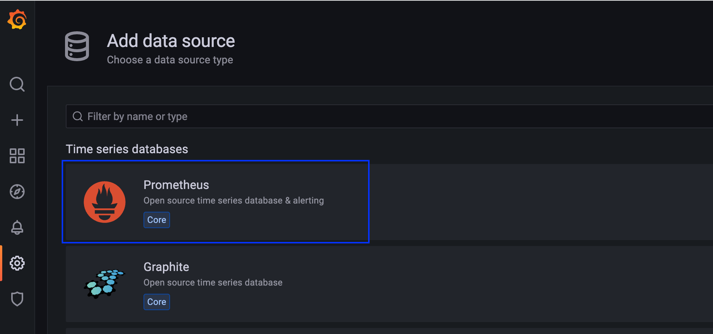
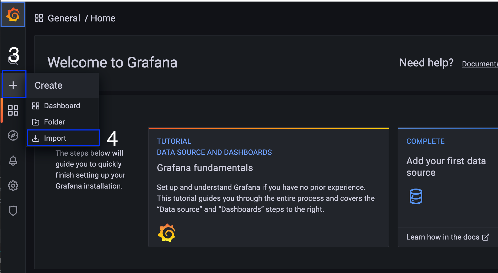
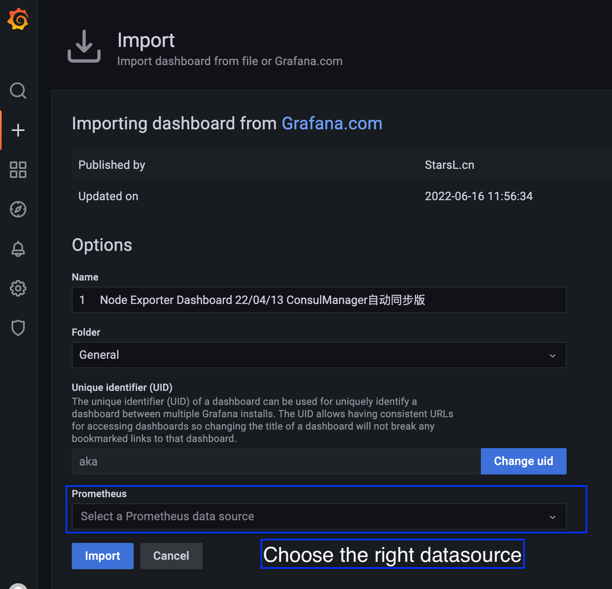
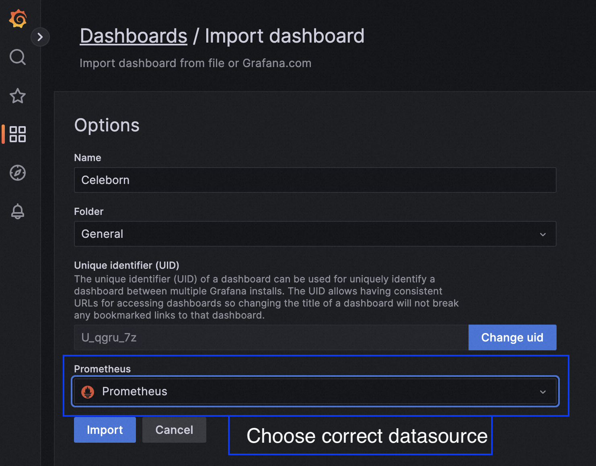

# Metrics

We provide various metrics about memory, disk, and important procedures. These metrics could help identify performance
issue or monitor Celeborn cluster.

## Prerequisites

1.Enable Celeborn metrics.
set rss.metrics.system.enabled = true  
2.You need to install prometheus(https://prometheus.io/)  
We provide an example for prometheus config file

```yaml
# prometheus example config
global:
  scrape_interval: 15s
  evaluation_interval: 15s

scrape_configs:
  - job_name: "Celeborn"
    metrics_path: /metrics/prometheus
    scrape_interval: 15s
    static_configs:
      - targets: [ "master-ip:9098","worker1-ip:9096","worker2-ip:9096","worker3-ip:9096","worker4-ip:9096" ]
```

3.You need to install Grafana server(https://grafana.com/grafana/download)

4.Import Celeborn dashboard into grafana.
You can find Celeborn dashboard at assets/grafana/rss-dashboard.json.


### Optional
We recommend you to install node exporter (https://github.com/prometheus/node_exporter)
on every host, and configure prometheus to scrape information about the host. 
Grafana will need a dashboard (dashboard id:8919) to display host details.

```yaml
global:
  scrape_interval: 15s
  evaluation_interval: 15s

scrape_configs:
  - job_name: "Celeborn"
    metrics_path: /metrics/prometheus
    scrape_interval: 15s
    static_configs:
      - targets: [ "master-ip:9098","worker1-ip:9096","worker2-ip:9096","worker3-ip:9096","worker4-ip:9096" ]
  - job_name: "node"
    static_configs:
      - targets: [ "master-ip:9100","worker1-ip:9100","worker2-ip:9100","worker3-ip:9100","worker4-ip:9100" ]
```

Here is an example of grafana dashboard importing.







## Details

|        MetricName         |       Role        |                                                  Description                                                   |
|:-------------------------:|:-----------------:|:--------------------------------------------------------------------------------------------------------------:|
|        WorkerCount        |      master       |                                          The count of active workers.                                          |
|  BlacklistedWorkerCount   |      master       |                                       The count of workers in blacklist.                                       |
|      OfferSlotsTime       |      master       |                                            The time of offer slots.                                            |
|       PartitionSize       |      master       |          The estimated partition size of last 20 flush window whose length is 15 seconds by defaults.          |
|  RegisteredShuffleCount   | master and worker |                                  The value means count of registered shuffle.                                  |
|      CommitFilesTime      |      worker       |                          CommitFiles means flush and close a shuffle partition file.                           |
|     ReserveSlotsTime      |      worker       |                    ReserveSlots means acquire a disk buffer and record partition location.                     |
|       FlushDataTime       |      worker       |                                  FlushData means flush a disk buffer to disk.                                  |
|      OpenStreamTime       |      worker       |            OpenStream means read a shuffle file and send client about chunks size and stream index.            |
|      FetchChunkTime       |      worker       |                     FetchChunk means read a chunk from a shuffle file and send to client.                      |
|    MasterPushDataTime     |      worker       |                       MasterPushData means handle pushdata of master partition location.                       |
|     SlavePushDataTime     |      worker       |                       MasterPushData means handle pushdata of slave partition location.                        |
|     PushDataFailCount     |      worker       |                                The count of failed PushData or PushMergedData.                                 |
|      TakeBufferTime       |      worker       |                             TakeBuffer means get a disk buffer from disk flusher.                              |
|      SlotsAllocated       |      worker       |                                          Slots allocated in last hour                                          |
|        NettyMemory        |      worker       |                        The value measures all kinds of transport memory used by netty.                         |
|         SortTime          |      worker       |                           SortTime measures the time used by sorting a shuffle file.                           |
|        SortMemory         |      worker       |                       SortMemory means total reserved memory for sorting shuffle files .                       |
|       SortingFiles        |      worker       |                              This value means the count of sorting shuffle files.                              |
|        SortedFiles        |      worker       |                              This value means the count of sorted shuffle files.                               |
|      SortedFileSize       |      worker       |                       This value means the count of sorted shuffle files 's total size.                        |
|        DiskBuffer         |      worker       | Disk buffers are part of netty used memory, means data need to write to disk but haven't been written to disk. |
|       PausePushData       |      worker       |                  PausePushData means the count of worker stopped receiving data from client.                   |
| PausePushDataAndReplicate |      worker       |   PausePushDataAndReplicate means the count of worker stopped receiving data from client and other workers.    |
|    RPCReserveSlotsNum     |      worker       |                          The count of the RPC `ReserveSlots` received by the worker.                           |
|    RPCReserveSlotsSize    |      worker       |                      The size of the RPC  `ReserveSlots` 's body received by the worker.                       |
|      RPCPushDataNum       |      worker       |                            The count of the RPC `PushData` received by the worker.                             |
|      RPCPushDataSize      |      worker       |                        The size of the RPC  `PushData` 's body received by the worker.                         |
|   RPCPushMergedDataNum    |      worker       |                       The count of the RPC `PushMergedData` RPC received by the worker.                        |
|   RPCPushMergedDataSize   |      worker       |                     The size of the RPC  `PushMergedData` 's body received by the worker.                      |
|     RPCCommitFilesNum     |      worker       |                           The count of the RPC `CommitFiles` received by the worker.                           |
|    RPCCommitFilesSize     |      worker       |                       The size of the RPC  `CommitFiles` 's body received by the worker.                       |
|       RPCDestroyNum       |      worker       |                             The count of the RPC `Destroy` received by the worker.                             |
|      RPCDestroySize       |      worker       |                         The size of the RPC  `Destroy` 's body received by the worker.                         |
|  RPCChunkFetchRequestNum  |      worker       |                      The count of the RPC `ChunkFetchRequest` RPC received by the worker.                      |

## Implementation

Celeborn master metric : `org/apache/celeborn/service/deploy/master/MasterSource.scala`
Celeborn worker metric : `org/apache/celeborn/service/deploy/worker/WorkerSource.scala`

## Grafana Dashboard

We provide a grafana dashboard for Celeborn [Grafana-Dashboard](assets/grafana/rss-dashboard.json). The dashboard was generated by grafana of version 8.5.0.
Here are some snapshots:


