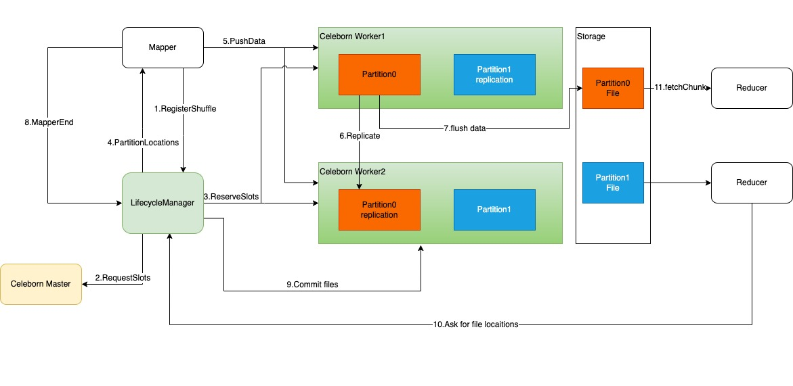
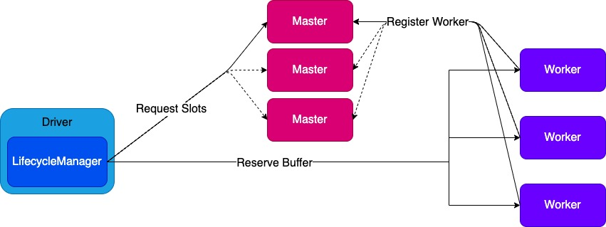

# Apache Celeborn (Incubating)

[](https://github.com/apache/incubator-celeborn/actions/workflows/maven.yml)  
Celeborn is dedicated to improving the efficiency and elasticity of
different map-reduce engines and provides an elastic, high-efficient 
management service for intermediate data including shuffle data, spilled data, result data, etc. Currently, Celeborn is focusing on shuffle data.

## Internals
### Architecture

Celeborn has three primary components: Master, Worker, and Client.
Master manages all resources and syncs shared states based on Raft.
Worker processes read-write requests and merges data for each reducer.
LifecycleManager maintains metadata of each shuffle and runs within the Spark driver.

### Feature
1. Disaggregate Computing and storage.
2. Push-based shuffle write and merged shuffle read.
3. High availability and high fault tolerance.

### Shuffle Process

1. Mappers lazily ask LifecycleManager to registerShuffle.
2. LifecycleManager requests slots from Master.
3. Workers reserve slots and create corresponding files.
4. Mappers get worker locations from LifecycleManager.
5. Mappers push data to specified workers.
6. Workers merge and replicate data to its peer.
7. Workers flush to disk periodically.
8. Mapper tasks accomplish and trigger MapperEnd event.
9. When all mapper tasks are complete, workers commit files.
10. Reducers ask for file locations.
11. Reducers read shuffle data.

### Load Balance


We introduce slots to achieve load balance. We will equally distribute partitions on every Celeborn worker by tracking slot usage.
The Slot is a logical concept in Celeborn Worker that represents how many partitions can be allocated to each Celeborn Worker.
Celeborn Worker's slot count is decided by `total usable disk size / average shuffle file size`.
Celeborn worker's slot count decreases when a partition is allocated and increments when a partition is freed.

## Build
1. Celeborn supports Spark 2.4/3.0/3.1/3.2/3.3/3.4, Flink 1.14/1.15/1.17 and Hadoop MapReduce 2/3.
2. Celeborn tested under Scala 2.11/2.12 and Java 8/11/17 environment.

Build Celeborn
```shell
./build/make-distribution.sh -Pspark-2.4/-Pspark-3.0/-Pspark-3.1/-Pspark-3.2/-Pspark-3.3/-Pspark-3.4/-Pflink-1.14/-Pflink-1.15/-Pflink-1.17/-Pmr
```

package apache-celeborn-${project.version}-bin.tgz will be generated.

> **_NOTE:_** The following table indicates the compatibility of Celeborn Spark and Flink clients with different versions of Spark and Flink for various Java and Scala versions.

|                | Java 8/Scala 2.11 | Java 8/Scala 2.12 | Java 11/Scala 2.12 | Java 17/Scala 2.12 |
|----------------|-------------------|-------------------|--------------------|--------------------|
| Spark 2.4      | &#10004;          | &#x274C;          | &#x274C;           | &#x274C;           |
| Spark 3.0      | &#x274C;          | &#10004;          | &#10004;           | &#x274C;           |
| Spark 3.1      | &#x274C;          | &#10004;          | &#10004;           | &#x274C;           |
| Spark 3.2      | &#x274C;          | &#10004;          | &#10004;           | &#x274C;           |
| Spark 3.3      | &#x274C;          | &#10004;          | &#10004;           | &#10004;           |
| Spark 3.4      | &#x274C;          | &#10004;          | &#10004;           | &#10004;           |
| Flink 1.14     | &#x274C;          | &#10004;          | &#10004;           | &#x274C;           |
| Flink 1.15     | &#x274C;          | &#10004;          | &#10004;           | &#x274C;           |
| Flink 1.17     | &#x274C;          | &#10004;          | &#10004;           | &#x274C;           |

### Package Details
Build procedure will create a compressed package.

General package layout:
```
    ├── RELEASE                         
    ├── bin                             
    ├── conf                            
    ├── jars           // common jars for master and worker                 
    ├── master-jars                     
    ├── worker-jars                     
    ├── spark          // Spark client jars if spark profiles are activated
    ├── flink          // Flink client jars if flink profiles are activated
    ├── mr             // MapReduce client jars if mr profile is activated
    └── sbin
```

### Compatibility
Celeborn server is compatible with all clients inside various engines.
However, Celeborn clients must be consistent with the version of the specified engine.
For example, if you are running Spark 2.4, you must compile Celeborn client with -Pspark-2.4;
if you are running Spark 3.2, you must compile Celeborn client with -Pspark-3.2; 
if you are running flink 1.14, you must compile Celeborn client with -Pflink-1.14.

## Usage
Celeborn cluster composes of Master and Worker nodes, the Master supports both single and HA mode(Raft-based) deployments.

### Deploy Celeborn
#### Deploy on host
1. Unzip the tarball to `$CELEBORN_HOME`
2. Modify environment variables in `$CELEBORN_HOME/conf/celeborn-env.sh`

EXAMPLE:
```properties
#!/usr/bin/env bash
CELEBORN_MASTER_MEMORY=4g
CELEBORN_WORKER_MEMORY=2g
CELEBORN_WORKER_OFFHEAP_MEMORY=4g
```
3. Modify configurations in `$CELEBORN_HOME/conf/celeborn-defaults.conf`

EXAMPLE: single master cluster
```properties
# used by client and worker to connect to master
celeborn.master.endpoints clb-master:9097

# used by master to bootstrap
celeborn.master.host clb-master
celeborn.master.port 9097

celeborn.metrics.enabled true
celeborn.worker.flusher.buffer.size 256k

# If Celeborn workers have local disks and HDFS. Following configs should be added.
# If Celeborn workers have local disks, use following config.
# Disk type is HDD by default.
celeborn.worker.storage.dirs /mnt/disk1:disktype=SSD,/mnt/disk2:disktype=SSD

# If Celeborn workers don't have local disks. You can use HDFS.
# Do not set `celeborn.worker.storage.dirs` and use following configs.
celeborn.storage.activeTypes HDFS
celeborn.worker.sortPartition.threads 64
celeborn.worker.commitFiles.timeout 240s
celeborn.worker.commitFiles.threads 128
celeborn.master.slot.assign.policy roundrobin
celeborn.rpc.askTimeout 240s
celeborn.worker.flusher.hdfs.buffer.size 4m
celeborn.storage.hdfs.dir hdfs://<namenode>/celeborn
celeborn.worker.replicate.fastFail.duration 240s

# If your hosts have disk raid or use lvm, set celeborn.worker.monitor.disk.enabled to false
celeborn.worker.monitor.disk.enabled false
```   

EXAMPLE: HA cluster
```properties
# used by client and worker to connect to master
celeborn.master.endpoints clb-1:9097,clb-2:9097,clb-3:9097

# used by master nodes to bootstrap, every node should know the topology of whole cluster, for each node,
# `celeborn.master.ha.node.id` should be unique, and `celeborn.master.ha.node.<id>.host` is required.
celeborn.master.ha.enabled true
celeborn.master.ha.node.id 1
celeborn.master.ha.node.1.host clb-1
celeborn.master.ha.node.1.port 9097
celeborn.master.ha.node.1.ratis.port 9872
celeborn.master.ha.node.2.host clb-2
celeborn.master.ha.node.2.port 9097
celeborn.master.ha.node.2.ratis.port 9872
celeborn.master.ha.node.3.host clb-3
celeborn.master.ha.node.3.port 9097
celeborn.master.ha.node.3.ratis.port 9872
celeborn.master.ha.ratis.raft.server.storage.dir /mnt/disk1/celeborn_ratis/

celeborn.metrics.enabled true
# If you want to use HDFS as shuffle storage, make sure that flush buffer size is at least 4MB or larger.
celeborn.worker.flusher.buffer.size 256k

# If Celeborn workers have local disks and HDFS. Following configs should be added.
# Celeborn will use local disks until local disk become unavailable to gain the best performance.
# Increase Celeborn's off-heap memory if Celeborn write to HDFS.
# If Celeborn workers have local disks, use following config.
# Disk type is HDD by default.
celeborn.worker.storage.dirs /mnt/disk1:disktype=SSD,/mnt/disk2:disktype=SSD

# If Celeborn workers don't have local disks. You can use HDFS.
# Do not set `celeborn.worker.storage.dirs` and use following configs.
celeborn.storage.activeTypes HDFS
celeborn.worker.sortPartition.threads 64
celeborn.worker.commitFiles.timeout 240s
celeborn.worker.commitFiles.threads 128
celeborn.master.slot.assign.policy roundrobin
celeborn.rpc.askTimeout 240s
celeborn.worker.flusher.hdfs.buffer.size 4m
celeborn.storage.hdfs.dir hdfs://<namenode>/celeborn
celeborn.worker.replicate.fastFail.duration 240s

# If your hosts have disk raid or use lvm, set celeborn.worker.monitor.disk.enabled to false
celeborn.worker.monitor.disk.enabled false
```

Flink engine related configurations:
```properties
# if you are using Celeborn for flink, these settings will be needed
celeborn.worker.directMemoryRatioForReadBuffer 0.4
celeborn.worker.directMemoryRatioToResume 0.6
# these setting will affect performance. 
# If there is enough off-heap memory, you can try to increase read buffers.
# Read buffer max memory usage for a data partition is `taskmanager.memory.segment-size * readBuffersMax`
celeborn.worker.partition.initial.readBuffersMin 512
celeborn.worker.partition.initial.readBuffersMax 1024
celeborn.worker.readBuffer.allocationWait 10ms
# Currently, shuffle partitionSplit is not supported, so you should disable split in celeborn worker side or set `celeborn.client.shuffle.partitionSplit.threshold` to a high value in flink client side.
celeborn.worker.shuffle.partitionSplit.enabled false
```

4. Copy Celeborn and configurations to all nodes
5. Start all services. If you install Celeborn distribution in the same path on every node and your
   cluster can perform SSH login then you can fill `$CELEBORN_HOME/conf/hosts` and
   use `$CELEBORN_HOME/sbin/start-all.sh` to start all
   services. If the installation paths are not identical, you will need to start the service manually.  
   Start Celeborn master  
   `$CELEBORN_HOME/sbin/start-master.sh`  
   Start Celeborn worker  
   `$CELEBORN_HOME/sbin/start-worker.sh`
6. If Celeborn starts success, the output of the Master's log should be like this:
```
22/10/08 19:29:11,805 INFO [main] Dispatcher: Dispatcher numThreads: 64
22/10/08 19:29:11,875 INFO [main] TransportClientFactory: mode NIO threads 64
22/10/08 19:29:12,057 INFO [main] Utils: Successfully started service 'MasterSys' on port 9097.
22/10/08 19:29:12,113 INFO [main] Master: Metrics system enabled.
22/10/08 19:29:12,125 INFO [main] HttpServer: master: HttpServer started on port 9098.
22/10/08 19:29:12,126 INFO [main] Master: Master started.
22/10/08 19:29:57,842 INFO [dispatcher-event-loop-19] Master: Registered worker
Host: 192.168.15.140
RpcPort: 37359
PushPort: 38303
FetchPort: 37569
ReplicatePort: 37093
SlotsUsed: 0()
LastHeartbeat: 0
Disks: {/mnt/disk1=DiskInfo(maxSlots: 6679, committed shuffles 0 shuffleAllocations: Map(), mountPoint: /mnt/disk1, usableSpace: 448284381184, avgFlushTime: 0, activeSlots: 0) status: HEALTHY dirs , /mnt/disk3=DiskInfo(maxSlots: 6716, committed shuffles 0 shuffleAllocations: Map(), mountPoint: /mnt/disk3, usableSpace: 450755608576, avgFlushTime: 0, activeSlots: 0) status: HEALTHY dirs , /mnt/disk2=DiskInfo(maxSlots: 6713, committed shuffles 0 shuffleAllocations: Map(), mountPoint: /mnt/disk2, usableSpace: 450532900864, avgFlushTime: 0, activeSlots: 0) status: HEALTHY dirs , /mnt/disk4=DiskInfo(maxSlots: 6712, committed shuffles 0 shuffleAllocations: Map(), mountPoint: /mnt/disk4, usableSpace: 450456805376, avgFlushTime: 0, activeSlots: 0) status: HEALTHY dirs }
WorkerRef: null
```

#### Deploy Celeborn on K8S
Please refer to our [website](https://celeborn.apache.org/docs/latest/deploy_on_k8s/)

### Deploy Spark client
Copy $CELEBORN_HOME/spark/*.jar to $SPARK_HOME/jars/

#### Spark Configuration
To use Celeborn,the following spark configurations should be added.
```properties
# Shuffle manager class name changed in 0.3.0:
#    before 0.3.0: org.apache.spark.shuffle.celeborn.RssShuffleManager
#    since 0.3.0: org.apache.spark.shuffle.celeborn.SparkShuffleManager
spark.shuffle.manager org.apache.spark.shuffle.celeborn.SparkShuffleManager
# must use kryo serializer because java serializer do not support relocation
spark.serializer org.apache.spark.serializer.KryoSerializer

# celeborn master
spark.celeborn.master.endpoints clb-1:9097,clb-2:9097,clb-3:9097
# This is not necessary if your Spark external shuffle service is Spark 3.1 or newer
spark.shuffle.service.enabled false

# options: hash, sort
# Hash shuffle writer use (partition count) * (celeborn.push.buffer.max.size) * (spark.executor.cores) memory.
# Sort shuffle writer uses less memory than hash shuffle writer, if your shuffle partition count is large, try to use sort hash writer.  
spark.celeborn.client.spark.shuffle.writer hash

# We recommend setting spark.celeborn.client.push.replicate.enabled to true to enable server-side data replication
# If you have only one worker, this setting must be false 
# If your Celeborn is using HDFS, it's recommended to set this setting to false
spark.celeborn.client.push.replicate.enabled true

# Support for Spark AQE only tested under Spark 3
# we recommend setting localShuffleReader to false to get better performance of Celeborn
spark.sql.adaptive.localShuffleReader.enabled false

# If Celeborn is using HDFS
spark.celeborn.storage.hdfs.dir hdfs://<namenode>/celeborn

# we recommend enabling aqe support to gain better performance
spark.sql.adaptive.enabled true
spark.sql.adaptive.skewJoin.enabled true

# Support Spark Dynamic Resource Allocation
# Required Spark version >= 3.5.0
spark.shuffle.sort.io.plugin.class org.apache.spark.shuffle.celeborn.CelebornShuffleDataIO
```

### Deploy Flink client
Copy $CELEBORN_HOME/flink/*.jar to $FLINK_HOME/lib/

#### Flink Configuration
To use Celeborn, the following flink configurations should be added.
```properties
shuffle-service-factory.class: org.apache.celeborn.plugin.flink.RemoteShuffleServiceFactory
celeborn.master.endpoints: clb-1:9097,clb-2:9097,clb-3:9097

celeborn.client.shuffle.batchHandleReleasePartition.enabled: true
celeborn.client.push.maxReqsInFlight: 128

# Network connections between peers
celeborn.data.io.numConnectionsPerPeer: 16
# threads number may vary according to your cluster but do not set to 1
celeborn.data.io.threads: 32
celeborn.client.shuffle.batchHandleCommitPartition.threads: 32
celeborn.rpc.dispatcher.numThreads: 32

# Floating buffers may need to change `taskmanager.network.memory.fraction` and `taskmanager.network.memory.max`
taskmanager.network.memory.floating-buffers-per-gate: 4096
taskmanager.network.memory.buffers-per-channel: 0
taskmanager.memory.task.off-heap.size: 512m
```

### Deploy mapreduce client 
Add $CELEBORN_HOME/mr/*.jar to to `mapreduce.application.classpath` and `yarn.application.classpath`.
And setting the following settings in YARN and MapReduce config.
```bash
-Dyarn.app.mapreduce.am.job.recovery.enable=false
-Dmapreduce.job.reduce.slowstart.completedmaps=1
-Dmapreduce.celeborn.master.endpoints=<master-1-1>:9097
-Dyarn.app.mapreduce.am.command-opts=org.apache.celeborn.mapreduce.v2.app.MRAppMasterWithCeleborn
-Dmapreduce.job.map.output.collector.class=org.apache.hadoop.mapred.CelebornMapOutputCollector
-Dmapreduce.job.reduce.shuffle.consumer.plugin.class=org.apache.hadoop.mapreduce.task.reduce.CelebornShuffleConsumer
```


### Best Practice
If you want to set up a production-ready Celeborn cluster, your cluster should have at least 3 masters and at least 4 workers.
Masters and works can be deployed on the same node but should not deploy multiple masters or workers on the same node.
See more detail in [CONFIGURATIONS](https://celeborn.apache.org/docs/latest/configuration/)

### Support Spark Dynamic Allocation
For Spark versions >= 3.5.0, Celeborn can be used with Dynamic Resource Allocation(DRA) 
when `spark.shuffle.sort.io.plugin.class` is set to `org.apache.spark.shuffle.celeborn.CelebornShuffleDataIO`.
Check [SPARK-42689](https://issues.apache.org/jira/browse/SPARK-42689) and [CELEBORN-911](https://issues.apache.org/jira/browse/CELEBORN-911)
for more details.

For Spark versions < 3.5.0, we provide a patch to enable users to use Spark with DRA and Celeborn.
- For Spark 2.x check [Spark2 Patch](assets/spark-patch/Celeborn_Dynamic_Allocation_spark2.patch).
- For Spark 3.0-3.3 check [Spark3 Patch](assets/spark-patch/Celeborn_Dynamic_Allocation_spark3.patch).
- For Spark 3.4 check [Spark3.4 Patch](assets/spark-patch/Celeborn_Dynamic_Allocation_spark3_4.patch).

### Metrics
Celeborn has various metrics. [METRICS](METRICS.md)

## Community and Support

### Subscribe Mailing Lists

Mail List is the most recognized form of communication in the Apache community.
Contact us through the following mailing list.

| Name                                                       | Scope                           |                                                          |                                                               |                                                                    |
|:-----------------------------------------------------------|:--------------------------------|:---------------------------------------------------------|:--------------------------------------------------------------|:-------------------------------------------------------------------|
| [dev@celeborn.apache.org](mailto:dev@celeborn.apache.org)  | Development-related discussions | [Subscribe](mailto:dev-subscribe@celeborn.apache.org)    | [Unsubscribe](mailto:dev-unsubscribe@celeborn.apache.org)     | [Archives](http://mail-archives.apache.org/mod_mbox/celeborn-dev/) |


### Report Issues or Submit Pull Request

If you meet any questions, feel free to file a 🔗[Jira Ticket](https://issues.apache.org/jira/projects/CELEBORN/issues) or connect us and fix it by submitting a 🔗[Pull Request](https://github.com/apache/incubator-celeborn/pulls).

| IM       | Contact Info                                                                                                                              | 
|:---------|:------------------------------------------------------------------------------------------------------------------------------------------|
| Slack    | 🔗[Slack](https://join.slack.com/t/apachecelebor-kw08030/shared_invite/zt-1ju3hd5j8-4Z5keMdzpcVMspe4UJzF4Q)                               | 
| DingTalk | 🔗[DingTalk](https://qr.dingtalk.com/action/joingroup?code=v1,k1,2OYn0jXy0SceP8CbLqiZUkFIOVtNOhtWbsi1oAUy9hw=&_dt_no_comment=1&origin=11) | 


### How to Contribute

This is an active open-source project. We are always open to developers who want to use the system or contribute to it. 
See more detail in [Contributing](CONTRIBUTING.md).
